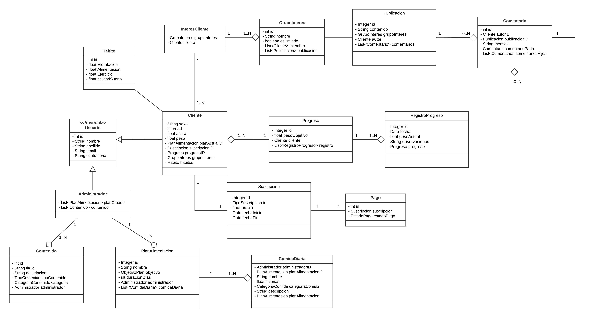
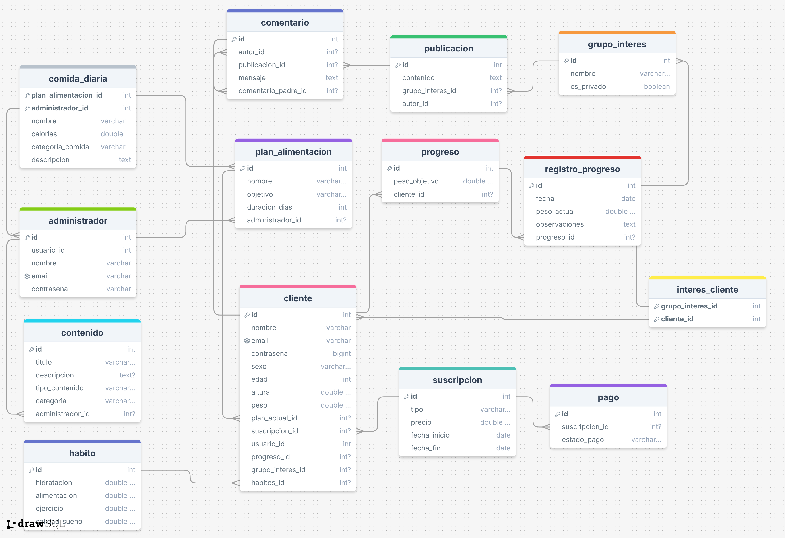

## Introducción

En la actualidad, el bienestar físico y mental ha cobrado una importancia crucial debido al creciente reconocimiento de su impacto en la calidad de vida y la prevención de enfermedades. Sin embargo, muchas personas enfrentan dificultades para mantener hábitos saludables de manera consistente debido a la falta de tiempo, motivación o herramientas que se adapten a sus necesidades específicas.

Este proyecto **Healty Bites** tiene como objetivo desarrollar un sistema integral de gestión de salud y bienestar que ayude a los usuarios a establecer, monitorear y mantener hábitos saludables personalizados. La plataforma permitirá la gestión de planes alimenticios, registro de actividad física, control de hábitos y seguimiento del progreso a lo largo del tiempo. A su vez, facilitará la interacción dentro de una comunidad en la que los usuarios puedan compartir sus logros y motivarse mutuamente.

El sistema está dirigido a un amplio público, incluyendo personas interesadas en mejorar su estilo de vida, pacientes que requieren un monitoreo continuo de su salud, y comunidades que promueven el bienestar colectivo. Al integrar herramientas de personalización, apoyo social y seguimiento constante, se busca no solo facilitar la adopción de hábitos saludables, sino también mantener a los usuarios motivados y comprometidos con sus objetivos a largo plazo.

### Colaboradores del Proyecto

| **Nombre**                            | **Rol**                              | **Perfil**                                               |
|---------------------------------------|--------------------------------------|----------------------------------------------------------|
| Valentin Emanuel Fernandez Gutierrez  | Líder del Proyecto                   | [LinkedIn](https://www.linkedin.com/in/valentin-fernandez-gutierrez-2a603b205/)           |
| Camila Luciana Moreno Quevedo         | Analista de Requisitos/Desarrollador | [LinkedIn](https://www.linkedin.com/in/camila-moreno-01871a324/)           |
| Alessia Vidamilagros Aguilar Alayo    | Desarrollador del Proyecto           | [LinkedIn](https://www.linkedin.com/in/alessia-aguilar-20a503200/)           |'
| Renzo Marcelo Lavado Flores           | Desarrollador del Proyecto           | [LinkedIn](https://www.linkedin.com/in/renzo-lavado-41aba2296/)           |
| Jhonnatan Gerardo Chavez del Castillo | Desarrollador del Proyecto           | [LinkedIn](https://www.linkedin.com/)           |

### Revisa el Progreso del Proyecto BookHub

| **Columna**       | **Descripción**     |
|-------------------|---------------------|
| **Backlog**       |Agrupa todas las historias de usuario, tareas y características que deben ser desarrolladas. Es un listado de todo el trabajo pendiente. |
| **En Progreso**   |Incluye las tareas que se están desarrollando actualmente. Muestra el trabajo en curso para garantizar un flujo continuo de actividades.|
| **Revisión**      |Una vez que se completa una tarea, se traslada a esta sección para una revisión de código y una revisión por pares. Esta etapa implica la creación de pull requests para asegurar que el código cumpla con los estándares de calidad antes de ser integrado en el proyecto principal.                    |
| **En Pruebas**    |Contiene las tareas que han superado la revisión de código y requieren pruebas exhaustivas (unitarias, de integración y de aceptación) para asegurar su calidad.                    |
| **Hecho**         |Las tareas que han sido completamente desarrolladas, revisadas y probadas se trasladan aquí, indicando que están listas y finalizadas.                |

Mira cómo va avanzando nuestro trabajo visitando el siguiente enlace: [Tablero de Trello](https://trello.com/b/X7usPWHI/healty-bites).

### Funcionalidades de la Aplicación Seguimiento de Habitos Saludables

#### **Módulo de Gestión de Usuarios**

- **Creación de Usuarios e Inicio de Sesión:**
    - Permitir a los usuarios registrarse en la plataforma introduciendo correo electrónico, contraseña y datos básicos.
    - Facilitar el inicio de sesión para acceder a la cuenta personal, diferenciando entre clientes y administradores.
    - Restablecimiento de contraseñas mediante un enlace seguro enviado por correo.
    - Opciones para actualizar el perfil del usuario, incluyendo datos de salud y preferencias.
    - Desactivación de cuentas para asegurar la privacidad de los datos del cliente.

#### **Módulo de Planes Alimenticios y Hábitos**

- **Gestión de Planes Alimenticios:**
    - Selección de planes alimenticios predeterminados con detalles como duración y objetivos.
    - Filtros por necesidades específicas (bajar de peso, ganar masa muscular, etc.).
    - Creación, modificación y eliminación de planes alimenticios por administradores.

- **Registro de Hábitos Diarios:**
    - Registro y seguimiento de hábitos diarios como alimentación, ejercicio e hidratación.

#### **Módulo de Seguimiento de Objetivos y Progreso**

- **Gestión de Objetivos de Salud:**
    - Establecimiento y actualización de objetivos de salud personalizados.
    - Registro y visualización de progreso en gráficos, con comparaciones respecto a los objetivos iniciales.
    - Recordatorios automáticos para objetivos no cumplidos.

#### **Módulo de Gestión de Contenidos y Recursos**

- **Acceso a Recursos Educativos:**
    - Acceso a una biblioteca de recursos educativos como artículos, videos y guías.
    - Recomendaciones de contenido personalizado basadas en los intereses y necesidades del usuario.
    - Administración y clasificación de contenido por temas relevantes.

#### **Módulo de Interacción en la Comunidad**

- **Interacción Comunitaria:**
    - Publicación de experiencias y logros personales relacionados con hábitos saludables.
    - Comentarios y reacciones a publicaciones de otros usuarios.
    - Creación de grupos de interés para discusión de temas específicos.

- **Moderación y Seguridad:**
    - Opciones para reportar contenido inapropiado, asegurando un ambiente respetuoso.
    - Seguimiento de otros usuarios para mantenerse actualizado sobre sus publicaciones.

#### **Módulo de Pagos y Suscripciones**

- **Gestión de Suscripciones:**
    - Selección de planes de suscripción (básico o premium) con detalles claros de beneficios.
    - Pagos seguros mediante diferentes métodos (tarjeta de crédito, PayPal, etc.).
    - Gestión de renovaciones de suscripción, incluyendo opciones automáticas y manuales.
    - Historial de pagos detallado y notificaciones sobre pagos y renovaciones.

## Diagramas de la Aplicación

Para entender mejor la estructura y diseño de la aplicación "Healty Bites", revisa los siguientes diagramas:

### Diagrama de Clases

### Diagrama de Base de Datos

Este diagrama ilustra el esquema de la base de datos utilizada por la aplicación, mostrando las tablas, columnas, y relaciones entre las entidades.

### Descripción de Capas del Proyecto

| capa        | descripción                                                                                                                                                                |
|-------------|----------------------------------------------------------------------------------------------------------------------------------------------------------------------------|
| api         | Contiene los controladores REST que manejan las solicitudes HTTP y las respuestas                                                                                          |
| entity      | Define las entidades del modelo de datos que se mapean a las tablas de la base de datos                                                                                    |
| repository  | Proporciona la interfaz para las operaciones CRUD y la interacción con la base de datos.                                                                                                                                                        |
| service     | Declara la lógica de negocio y las operaciones que se realizarán sobre las entidades.                                                                                                                                                       |
| service impl| Implementa la lógica de negocio definida en los servicios, utilizando los repositorios necesarios.                                                                                                                                                        |